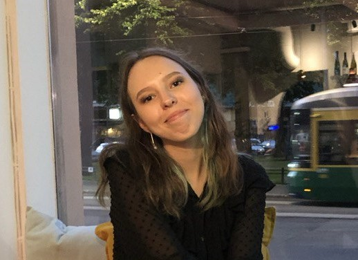

## Introduction

 I am a second-year master's student of language technology. In addition to this, I decided to delve deeper into studying programming, data science and machine learning.My academic background has equipped me with strong skills in working with large datasets, data visualization using Python, and querying databases with SQL. During my studies, I gained experience participating in team projects related to data analysis, where my creativity, precision, attention to detail, and interest in processing and analyzing large and complex datasets were invaluable.

## Find me on

[LinkedIn](https://www.linkedin.com/in/sofia-gruk-7a59b0281/), [GitHub](https://github.com/gruksd)

## Contact

E-mail: sofia.gruk@helsinki.fi Mobile: +358407771325 

## Courses I've Taken

[Command Line Tools for Linguists](https://studies.helsinki.fi/kurssit/toteutus/hy-opt-cur-2425-261401a1-c550-4436-91b9-7edf4a1a3b57/KIK-LG221), fall 2024, 4/5
[Machine Learning for Linguists](https://studies.helsinki.fi/kurssit/toteutus/hy-opt-cur-2425-6baf2c75-648b-46ee-94e3-b8e47f50083f/LDA-T317), spring 2022, 4/5 
[Data Structures and Algorithms I](https://studies.helsinki.fi/kurssit/toteutus/otm-90a22808-1e7d-4001-b5b9-ee1e7e02cad1/BSCS10031), winter 2024, 3/5
[Data Analysis with Python](https://studies.helsinki.fi/kurssit/toteutus/otm-cb7124aa-c918-4a0e-8e3e-1ecabe45f827/BSCS2015), summer 2024, 4/5
[Introduction to Databases](https://studies.helsinki.fi/kurssit/toteutus/otm-c05c3235-3c6c-4079-89da-e0d47fbaf3a9/TKT10004), summer 2024, 4/5
[Basics of mathematics in machine learning I and II](https://studies.helsinki.fi/kurssit/toteutus/hy-opt-cur-2324-d350dc54-bfe4-4081-9df1-e070aa033b22/MAT11015), winter-spring 2024, 4/5

## Projects

[Movie Search Engine](https://github.com/pietarikoneella/NLPtrio), This is  program is a search engine that will help you choose a movie for every taste. It is based on the top 250 movies according to the IMDb (Internet Movie Database) site and we offer our users to find films that will exactly meet their requirements.
[Metaphors and LMs](https://github.com/gruksd/metaphors_nlu_project), For this project, the overarching goal is to deepen the understanding with regard to the question whether language models understand metaphors. Given the difficulty and complexity of the task, it was decided to approximate the question via three subtasks: 1. Paraphrase Classification, 2. Metaphor Paraphrase Generation and 3. Definition Modelling.
[Data generation and formation](https://github.com/gruksd/cmdline-course), This project presents scripts for data formation, namely for splitting text into sentences, tokenization, token counting, etc.

## Misc. 

[Instagram](https://www.instagram.com/itssonyaaaaaa/) 
